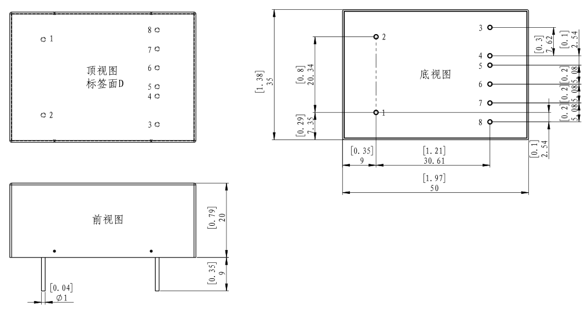
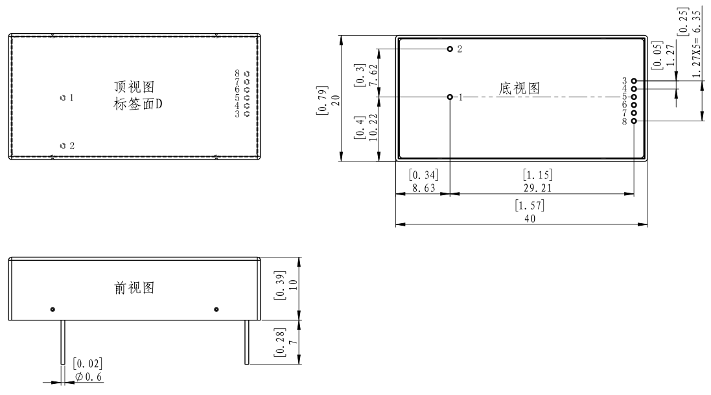

### 要求：2000V输出
# 东文高压
## [超小型高压模块电源](https://www.tjindw.com/pc/category/index/id/145.html)

| 系列  | 输出电压(kV)                             | 最大功率                                   | 输出电压控制方式 | 启停功能 | 引出方式 | 外形尺寸             | 产品特点                                                                | 附件  |
| --- | ------------------------------------ | -------------------------------------- | -------- | ---- | ---- | ---------------- | ------------------------------------------------------------------- | --- |
| P1  | 0.5   1.0   2.0   3.0 | 3   4   5   6   10 | 外控/电位器   | 有    | 引针   | 45 $*$ 23 $*$ 15 | 金属壳体、超小体积、重量轻；  输出电压连续线性可调； 良好的输出过载及短路保护功能； 低EMI、抗干扰能力强 |     |
| S1  | 1.0   1.5   2.0   2.5 | 0.5   0.75   1               | 外控/电位器   | 无    | 引针   | 40 $*$ 20 $*$ 10 | 金属壳体、超小体积、重量轻； 输出电压连续线性可调； 良好的输出过载及短路保护功能； 低EMI、抗干扰能力强  |     |

### P1 系列选型

| 电源型号 | 输入电压 | 输出电压范围 | 输出电流 | 纹波噪声 | 电压调整率 | 负载调整率 |
| --- | --- | --- | --- | --- | --- | --- |
| DW-P202-2BP1 | +9VDC $\pm$ 10% | 0 $\sim$ +2000 V | 2 mA | $\leq$ 0.1% | $\leq$ 0.1% | $\leq$ 0.5% |
| DW-P202-2CP1 | +12VDC $\pm$ 10% | 0 $\sim$ +2000 V | 2 mA | $\leq$ 0.05% | $\leq$ 0.1% | $\leq$ 0.5% |
| DW-P202-2FP1 | +24VDC $\pm$ 2V | 0 $\sim$ +2000 V | 2 mA | $\leq$ 0.05% | $\leq$ 0.1% | $\leq$ 0.5% |

#### 外形结构及尺寸

### [S1 系列选型](https://www.tjindw.com/pc/arc/show/id/221/cid/145.html)

| 电源型号 | 输入电压 | 输出电压范围 | 输出电流 | 纹波噪声 | 电压调整率 | 负载调整率 |
| --- | --- | --- | --- | --- | --- | --- |
| **[[DW-P202-0.5CS1]]** | +12VDC $\pm$ 1V | 0 $\sim$ +2000 V | 0.5 mA | $\leq$ 0.005% | $\leq$ 0.05% | $\leq$ 0.1% |
| DW-P202-0.5FS1 | +24VDC $\pm$ 2V | 0 $\sim$ +2000 V | 0.5 mA | $\leq$ 0.005% | $\leq$ 0.05% | $\leq$ 0.1% |

#### 外形结构及尺寸

### 引针功能定义

| 序号 | 引针符号 | 功能定义 |
| --- | --- | --- |
| 1 | HV | 高压输出 |
| 2 | HGND | 输出地 |
| 3 | +Vin | 供电输入 |
| 4 | GND | 输入地 | 
| 5 | GND1 | 控制地 |
| 6 | R/S | 启动/停止 |
| 7 | Vadj | 控制电压 |
| 8 | Vref | 基准电压 |